# Netflix Data Analytics

> **Analyzed 8,807 Netflix titles using Python, PostgreSQL, SQL, and Power BI to build a semi-automated analytics workflow and an interactive dashboard.**

### Project at a Glance

| Metric | Result |
|---|---:|
| 🎬 Netflix titles analyzed | **8,807** |
| 🎞️ Movies analyzed | **6,131** |
| 📺 TV Shows analyzed | **2,676** |
| 📊 Original dataset fields | **12** |
| 🧹 Analytical fields after transformation | **18** |
| 📈 Matplotlib visualizations | **12** |
| 🔍 Basic EDA visualizations | **6** |
| 🧠 Advanced EDA visualizations | **6** |
| 💡 Power BI KPIs | **3** |
| 🎛️ Power BI slicers | **3** |

---

## Dashboard Preview

The final Power BI dashboard combines key metrics, interactive filters, content distribution, ratings, genres, and content-addition trends into a single analytics view.

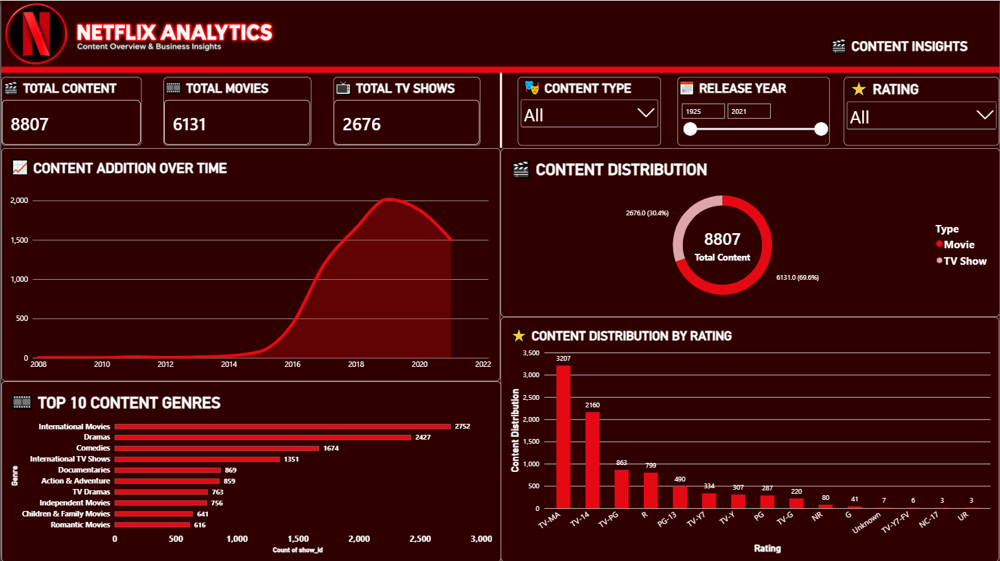

---

## Project Overview

This project transforms a raw Netflix catalog into a structured, validated, and analysis-ready dataset.

The workflow combines:

- **Python** for data inspection, cleaning, transformation, validation, and exploratory analysis
- **PostgreSQL** for structured data storage
- **SQL** for analytical and business-focused queries
- **Matplotlib** for exploratory visualizations
- **Power BI** for interactive reporting and dashboarding

The project analyzes **8,807 titles** across **6,131 Movies** and **2,676 TV Shows**, covering ratings, genres, countries, release years, Netflix addition dates, runtime, and season information.

---

## Problem Statement

Working with a content catalog often involves repetitive data-preparation tasks before meaningful analysis can begin.

A raw dataset can contain:

- Missing values
- Duplicate records
- Inconsistent data types
- Multiple categories stored in a single field
- Incorrect or malformed values
- Dates that require transformation
- Duration values stored in different formats
- Data that is difficult to use directly for time-based analysis

Manually repeating these preparation steps increases effort and makes analysis less consistent.

This project demonstrates how repetitive data-processing tasks can be handled programmatically and then connected to SQL and BI tools for structured analysis and reporting.

---

## Data Source

The project uses the publicly available **Netflix Movies and TV Shows** dataset published on **Kaggle by Shivam Bansal**.

The dataset contains Netflix movie and TV-show listings with metadata such as:

- Show ID
- Type
- Title
- Director
- Cast
- Country
- Date Added
- Release Year
- Rating
- Duration
- Genres
- Description

**Source:** Kaggle — *Netflix Movies and TV Shows* by Shivam Bansal

The original dataset is preserved separately from the cleaned analytical dataset.

### Dataset Files

```text
Dataset/
├── netflix_catalog_raw.csv
├── netflix_catalog_cleaned.csv
├── Analysis_Outputs/
└── EDA_Charts/
```

- `netflix_catalog_raw.csv` → original source dataset
- `netflix_catalog_cleaned.csv` → cleaned and transformed analytical dataset

---

## What This Project Does

The project takes the raw Netflix catalog through multiple analytical stages:

```text
Raw Netflix Catalog
        ↓
Data Inspection
        ↓
Data Cleaning
        ↓
Data Validation
        ↓
Basic EDA
        ↓
Advanced EDA
        ↓
PostgreSQL
        ↓
SQL Analysis
        ↓
Power BI Dashboard
```

The main objective is to turn raw catalog data into reliable analytical information and interactive business-style reporting.

---

## Semi-Automated Analytics Workflow

### What is automated?

The Python workflow handles the repetitive data-processing logic programmatically.

The scripts perform:

1. Data inspection
2. Missing-value analysis
3. Duplicate detection
4. Data cleaning
5. Malformed-value correction
6. Date conversion
7. Time-based feature creation
8. Duration extraction
9. Data validation
10. Exploratory analysis
11. Advanced analysis
12. Generation of analysis-output CSV files
13. Generation of Matplotlib visualizations

### Data transformations

The cleaning workflow creates additional analytical fields:

```text
added_year
added_month
added_month_name
added_quarter
duration_value
duration_unit
```

This transforms the original **12-field dataset into an 18-field analytical dataset**.

### Why is it called semi-automated?

The repetitive processing logic is automated through Python scripts, but the current implementation still requires manual execution of the scripts and manual refresh of the Power BI dashboard.

Therefore, the project is intentionally described as a **semi-automated analytics workflow**, rather than a fully automated production pipeline.

---

## Data Quality Work

The project includes a dedicated inspection and validation stage before analysis.

The workflow checks:

- Dataset dimensions
- Column structure
- Missing values
- Duplicate records
- Duplicate IDs
- Data types
- Date ranges
- Release-year ranges
- Content-type consistency
- Duration-unit consistency

The raw dataset contained missing values across several metadata fields, including director, cast, country, date added, rating, and duration.

The cleaning workflow also identified malformed rating values such as:

```text
74 min
84 min
66 min
```

These values represented runtime information stored in the rating field and were corrected during preprocessing.

---

## Python Data Preparation

### 1. Data Inspection

Python was used to understand the structure and quality of the raw dataset.

The inspection stage checks:

- Number of rows and columns
- Column names
- Data types
- Missing values
- Duplicate rows
- Unique values
- Invalid or malformed values

### 2. Data Cleaning

The cleaning stage performs tasks such as:

- Standardizing text fields
- Handling missing values
- Correcting malformed rating/runtime values
- Converting dates
- Creating time-based analytical fields
- Extracting numeric duration values
- Identifying duration units
- Removing duplicate records

### 3. Data Validation

After cleaning, the dataset is validated again before being used for SQL and visualization.

Validation checks include:

- Duplicate rows
- Duplicate IDs
- Missing-value conditions
- Content-type distribution
- Duration units
- Release-year range
- Date-added range
- Data consistency

---

## Exploratory Data Analysis

The project contains **12 Matplotlib visualizations**, divided into **6 Basic EDA** charts and **6 Advanced EDA** charts.

### Basic EDA — 6 Visualizations

1. Movies vs TV Shows Added by Year
2. Top Movie Genres
3. Top TV Show Genres
4. Netflix Content Added by Month
5. Movie Duration Distribution
6. TV Shows by Number of Seasons

### Advanced EDA — 6 Visualizations

1. Top 10 Netflix Ratings
2. Ratings by Content Type
3. Top 15 Countries by Content Count
4. Cumulative Netflix Content Additions
5. Release Year Distribution by Content Type
6. Movie Duration by Rating

All generated visualizations are available in:

```text
Dataset/EDA_Charts/
```

---

## Basic EDA Visualizations

| Visualization | Visualization |
|---|---|
| 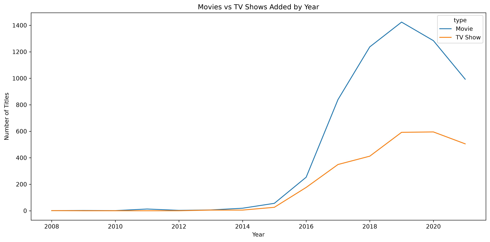 | 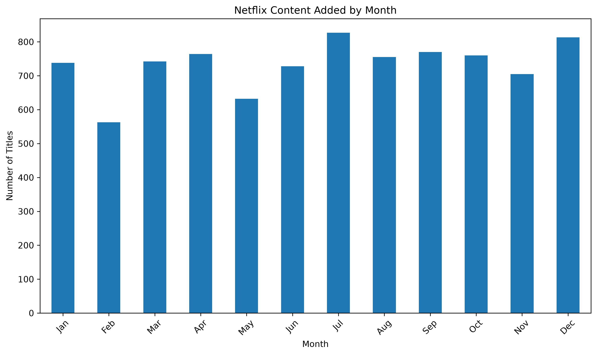 |
| 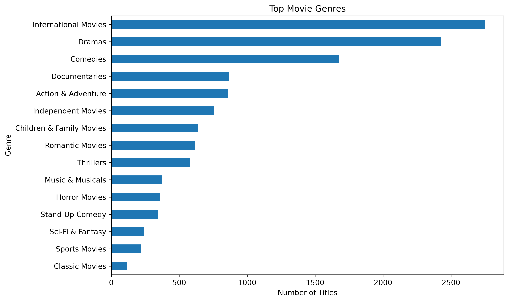 | 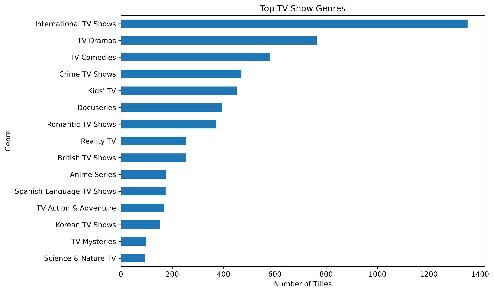 |
| 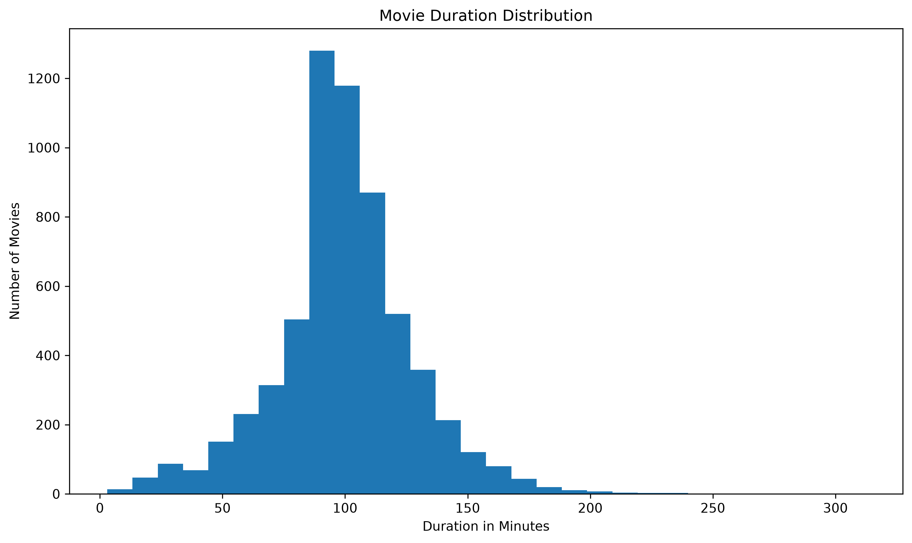 | 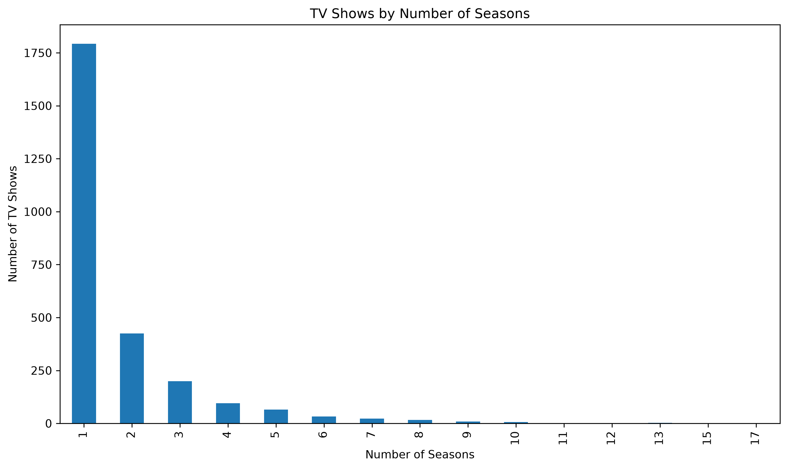 |

---

## Advanced EDA Visualizations

| Visualization | Visualization |
|---|---|
| 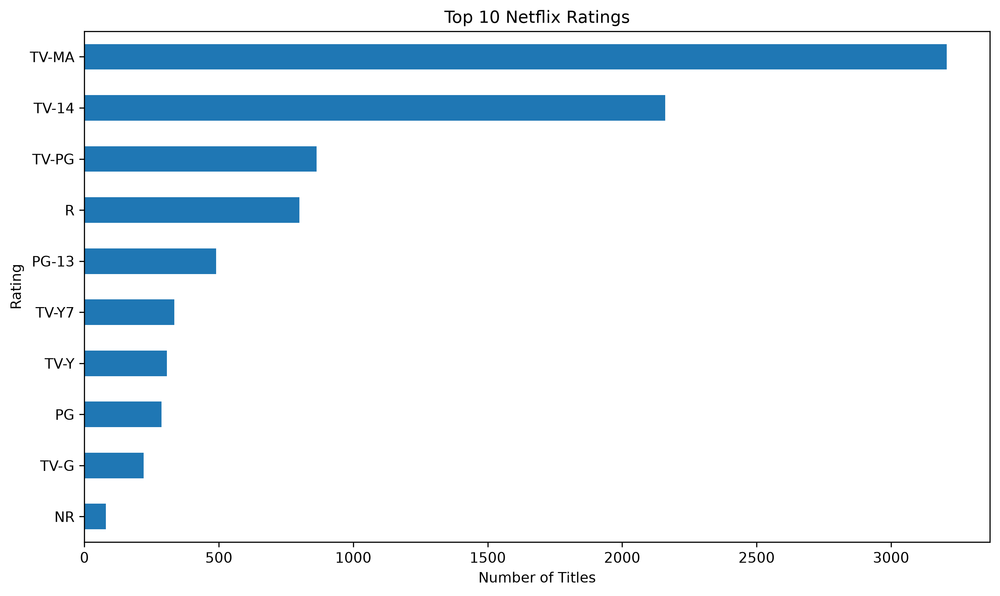 | 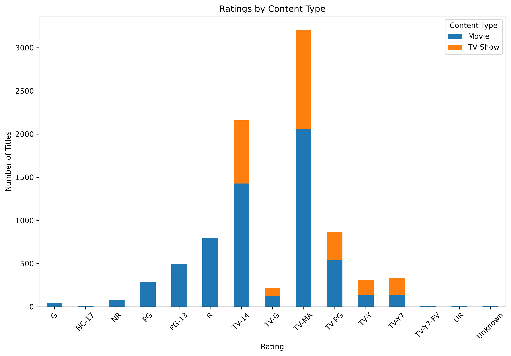 |
| 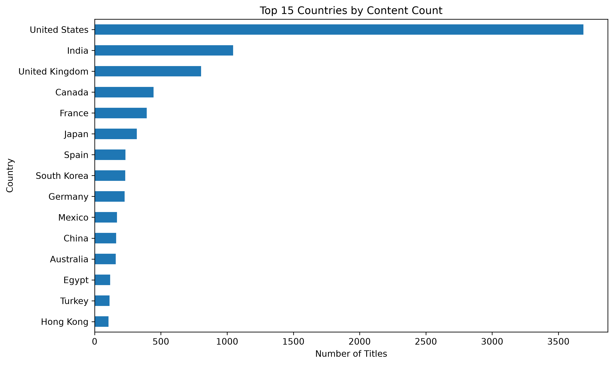 | 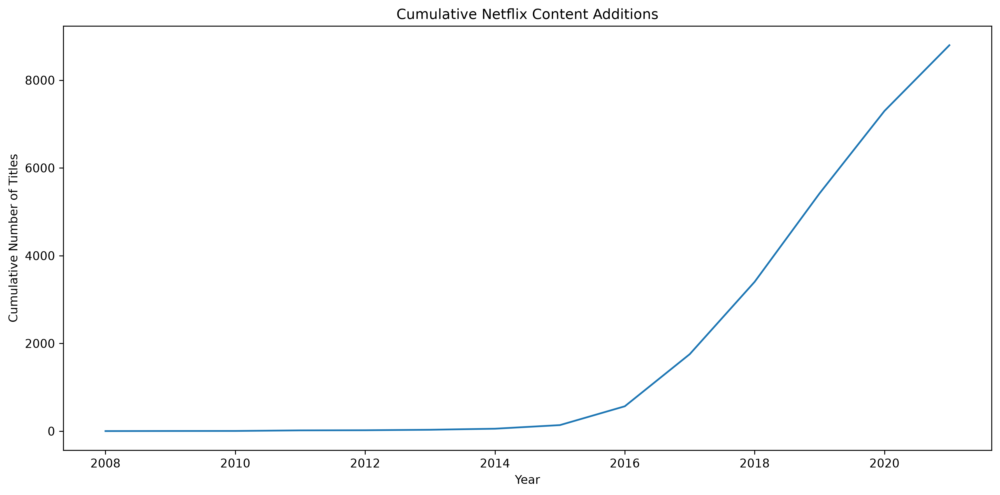 |
| 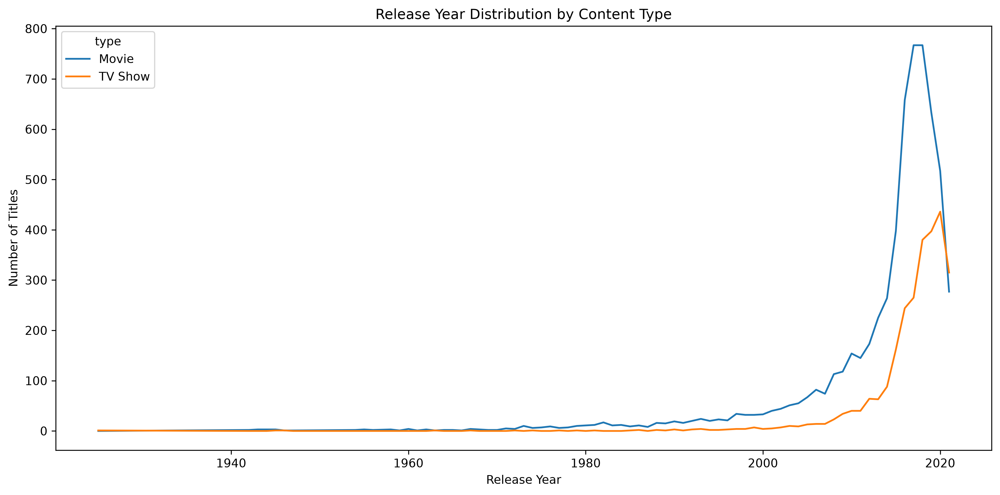 | 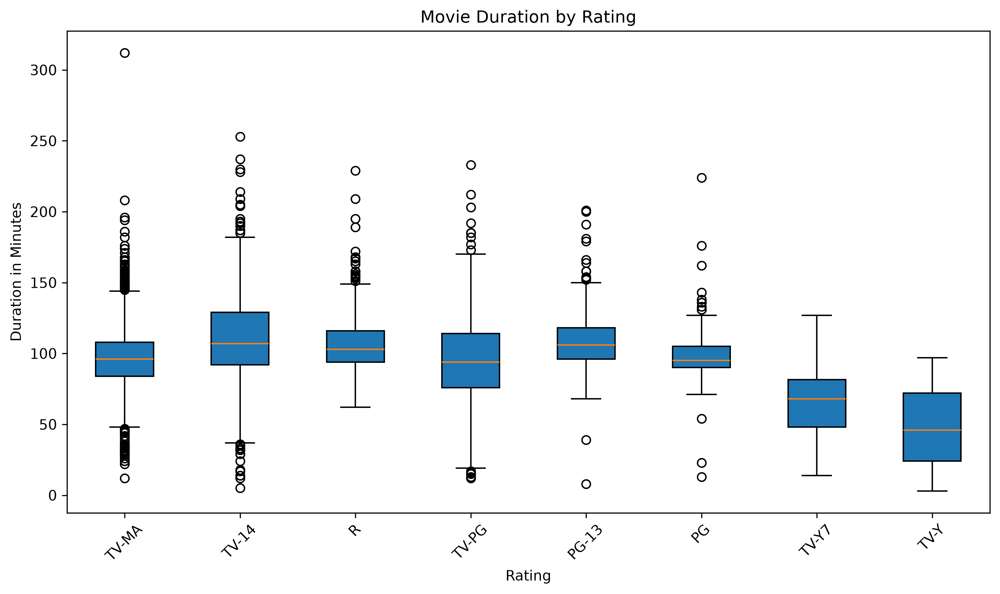 |

---

## PostgreSQL & SQL Analysis

The cleaned catalog is loaded into PostgreSQL for structured analysis.

### PostgreSQL Table

```text
netflix_titles
```

### SQL Analysis Areas

The SQL layer covers:

- Content type distribution
- Rating distribution
- Yearly content additions
- Genre analysis
- Content comparisons
- Advanced analytical queries
- Business-focused content questions

### SQL Files

```text
Sql/
├── create_database.sql
├── data_loading.sql
├── analysis.sql
├── advance_analysis.sql
├── business_analysis.sql
└── netflix_analytics.sql
```

The SQL scripts are included so that the database structure and analytical logic can be reviewed independently from the Power BI dashboard.

---

## Power BI Dashboard

The final Power BI report converts the analytical results into an interactive dashboard.

### Dashboard Components

#### KPIs

- **Total Content:** 8,807
- **Total Movies:** 6,131
- **Total TV Shows:** 2,676

#### Interactive Slicers

- **Content Type**
- **Release Year**
- **Rating**

#### Analytical Visuals

- Content Distribution
- Content Distribution by Rating
- Top 10 Content Genres
- Content Addition Over Time

The dashboard uses a Netflix-inspired dark red visual theme with interactive filtering.

### Power BI Files

```text
PowerBI/
├── Netflix_Analytics_Dashboard.pbix
└── dashboard_screenshot.png
```

---

## Real-World Applications

Although this project uses a public Netflix catalog dataset, the same workflow can be applied to many real-world content and catalog analytics scenarios.

Potential applications include:

- Monitoring catalog size and composition
- Tracking the growth of movies and TV shows
- Comparing content categories and formats
- Monitoring rating distributions
- Identifying high-volume genres
- Comparing content across countries
- Studying runtime and season patterns
- Tracking additions over time
- Creating repeatable reporting workflows
- Supporting content planning and catalog-management analysis

The main practical value of the project is the reusable workflow:

```text
Raw Data
→ Cleaning
→ Validation
→ Analysis
→ SQL
→ Visualization
→ Interactive Reporting
```

---

## Key Analytical Areas

The project analyzes:

- **8,807** Netflix titles
- **6,131** Movies
- **2,676** TV Shows
- Content added over time
- Release-year patterns
- Rating distribution
- Content by country
- Genre distribution
- Movie runtime
- TV show season counts
- Content-type differences

A key distinction in the analysis is between:

- **Release Year** → when the content was originally released
- **Added Year** → when the content was added to the Netflix catalog

This allows the project to examine both content age and catalog-addition trends.

---

## Project Architecture

```text
                         ┌─────────────────────┐
                         │  Netflix Raw Data   │
                         └──────────┬──────────┘
                                    ↓
                         ┌─────────────────────┐
                         │ Python Inspection   │
                         └──────────┬──────────┘
                                    ↓
                         ┌─────────────────────┐
                         │ Python Cleaning     │
                         └──────────┬──────────┘
                                    ↓
                         ┌─────────────────────┐
                         │ Data Validation     │
                         └──────────┬──────────┘
                                    ↓
                  ┌─────────────────┴─────────────────┐
                  ↓                                   ↓
        ┌─────────────────────┐             ┌─────────────────────┐
        │ Basic EDA           │             │ Advanced EDA        │
        │ 6 Visualizations    │             │ 6 Visualizations    │
        └──────────┬──────────┘             └──────────┬──────────┘
                   └─────────────────┬─────────────────┘
                                     ↓
                          ┌─────────────────────┐
                          │ PostgreSQL + SQL    │
                          └──────────┬──────────┘
                                     ↓
                          ┌─────────────────────┐
                          │ Power BI Dashboard  │
                          └─────────────────────┘
```

---

## Repository Structure

```text
Netflix-Data-Analytics/
│
├── Dataset/
│   ├── netflix_catalog_raw.csv
│   ├── netflix_catalog_cleaned.csv
│   │
│   ├── Analysis_Outputs/
│   │   ├── content_type_summary.csv
│   │   ├── rating_distribution.csv
│   │   └── yearly_content_additions.csv
│   │
│   └── EDA_Charts/
│       ├── advanced_cumulative_content_growth.png
│       ├── advanced_movie_duration_by_rating.png
│       ├── advanced_ratings_by_content_type.png
│       ├── advanced_release_year_distribution.png
│       ├── advanced_top_10_ratings.png
│       ├── advanced_top_15_countries.png
│       ├── movie_duration_distribution.png
│       ├── movies_vs_tv_shows_added_by_year.png
│       ├── netflix_content_added_by_month.png
│       ├── top_movie_genres.png
│       ├── top_tv_show_genres.png
│       └── tv_shows_by_number_of_seasons.png
│
├── Python/
│   ├── data_inspection.py
│   ├── data_cleaning.py
│   ├── data_validation.py
│   ├── exploratory_data_analysis.py
│   ├── advanced_eda.py
│   └── postgresql_analysis.py
│
├── PowerBI/
│   ├── Netflix_Analytics_Dashboard.pbix
│   └── dashboard_screenshot.png
│
├── Sql/
│   ├── create_database.sql
│   ├── data_loading.sql
│   ├── analysis.sql
│   ├── advance_analysis.sql
│   ├── business_analysis.sql
│   └── netflix_analytics.sql
│
├── .gitignore
├── Readme.md
└── Requirements.txt
```

---

## How to Run the Project

### 1. Clone the repository

```bash
git clone <your-repository-link>
cd Netflix-Data-Analytics
```

### 2. Install Python dependencies

```bash
pip install -r Requirements.txt
```

### 3. Run the Python workflow

Run the scripts from the project root:

```bash
python Python/data_inspection.py
python Python/data_cleaning.py
python Python/data_validation.py
python Python/exploratory_data_analysis.py
python Python/advanced_eda.py
```

### 4. PostgreSQL

Create the PostgreSQL database and table using the SQL scripts in the `Sql` folder.

The PostgreSQL connection uses your local database configuration.

The project does **not** store PostgreSQL passwords in the repository.

### 5. Power BI

Open:

```text
PowerBI/Netflix_Analytics_Dashboard.pbix
```

Connect or refresh the PostgreSQL data source using your own local PostgreSQL configuration.

---

## Tools & Technologies

| Technology | Purpose |
|---|---|
| Python | Data processing and analysis |
| Pandas | Data cleaning, transformation, aggregation |
| NumPy | Numerical processing |
| Matplotlib | Exploratory visualization |
| PostgreSQL | Structured data storage |
| SQL | Analytical querying |
| Power Query | Data preparation in Power BI |
| DAX | KPI and analytical measures |
| Power BI | Interactive dashboard |
| VS Code | Development environment |
| psycopg2 | Python–PostgreSQL database connectivity |

---

## Skills Demonstrated

- Python for Data Analysis
- Pandas
- Data Cleaning
- Data Validation
- Feature Engineering
- Exploratory Data Analysis
- Advanced EDA
- SQL
- PostgreSQL
- Data Aggregation
- Analytical Querying
- Power Query
- DAX
- Power BI
- Dashboard Design
- KPI Development
- Data Visualization

---

## Key Project Takeaways

This project demonstrates how different analytics tools can work together in a single workflow.

**Python** handles repeatable data preparation and exploratory analysis.

**PostgreSQL and SQL** provide structured storage and analytical querying.

**Power BI** converts the analysis into an interactive dashboard suitable for business-style reporting.

The result is a **semi-automated Netflix data analytics workflow built around 8,807 records, 18 analytical fields, 12 exploratory visualizations, 3 KPIs, and 3 interactive slicers.**

---

## Author

**Prashant Raj**

B.Tech — Computer Science & Engineering

GitHub: rajprashant2064
